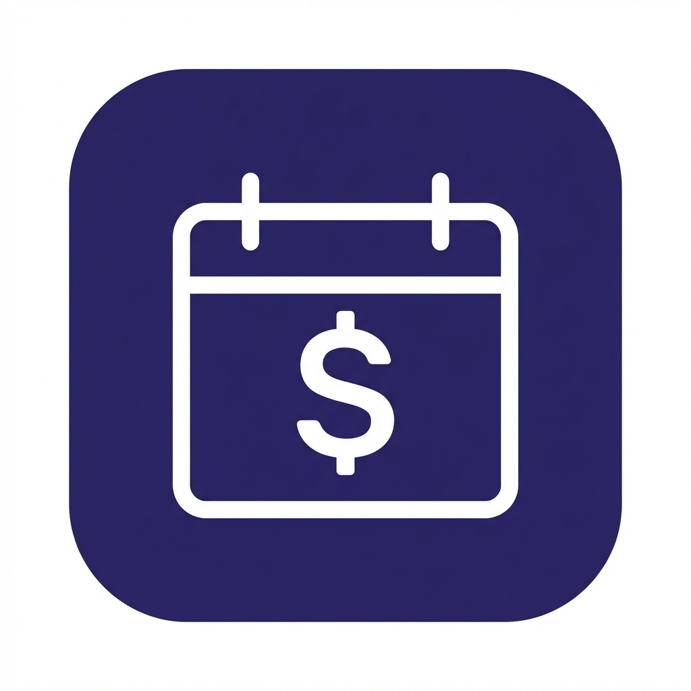

# Subscripfy 💰

**Stop unwanted charges. Track bills & subscriptions offline.**

Subscripfy is a privacy-focused financial manager built with Flutter. Unlike other apps, it works 100% offline and never asks for your bank login credentials.

## 🚀 Download
**[Download the latest APK here](https://github.com/ianisd/subscripfy/releases)**  
*(Click "Assets" in the latest release to find the .apk file)*

## ✨ Features
*   **Privacy First:** No bank linking required. Data is stored locally using Hive NoSQL.
*   **Smart Reminders:** Get notified 1 day before a bill is due (Local Notifications).
*   **Freemium Model:** Manage up to 5 subscriptions for free, or upgrade to Unlimited.
*   **Ad-Supported:** Integrated AdMob banner ads for free users.
*   **Dark Mode:** Fully supported dark/light theme toggle.
*   **Global:** Support for multiple currencies (USD, EUR, GBP, ZAR, etc.).

## 🛠️ Tech Stack
*   **Framework:** Flutter (Dart)
*   **State Management:** Provider
*   **Database:** Hive (NoSQL)
*   **Notifications:** Flutter Local Notifications
*   **Monetization:** Google Mobile Ads (AdMob)

## 📸 Screenshots
| Home Screen | Dark Mode | Settings |
|:---:|:---:|:---:|
|  |  |  |

## 📦 Installation
1.  Clone the repo
2.  Run `flutter pub get`
3.  Run `dart run build_runner build` (to generate Hive adapters)
4.  Run `flutter run`

---
**Developed by [Your Name]**